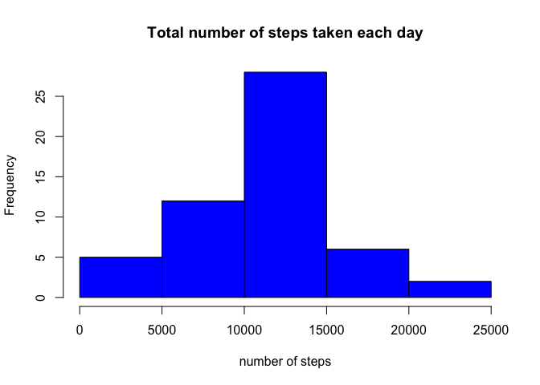
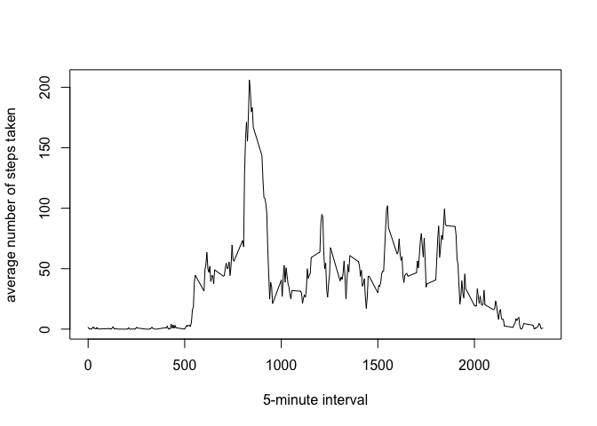
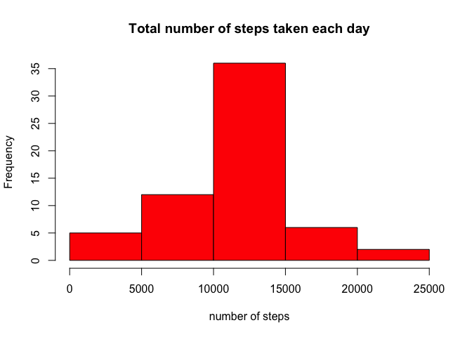
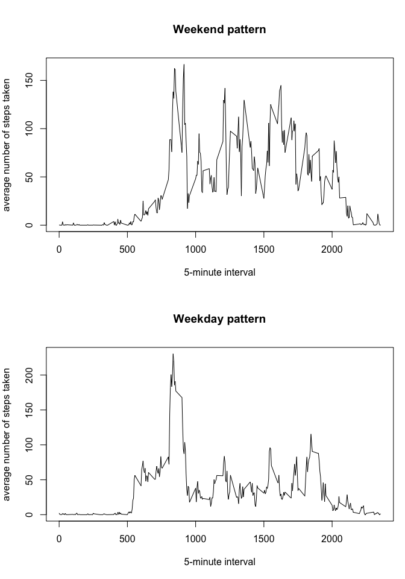

# Reproducible Research: Peer Assessment 1
Bruno Tovar  
07 de janeiro de 2016

### Introduction

This assignment makes use of data from a personal activity monitoring device. This device collects data at 5 minute intervals through out the day. The data consists of two months of data from an anonymous individual collected during the months of October and November, 2012 and include the number of steps taken in 5 minute intervals each day.


### Data

The data for this assignment can be downloaded from the course web site:  
- Dataset: [Activity monitoring data](https://d396qusza40orc.cloudfront.net/repdata%2Fdata%2Factivity.zip) [52K]  
  
The variables included in this dataset are:  
- steps: Number of steps taking in a 5-minute interval (missing values are coded as NA)  
- date: The date on which the measurement was taken in YYYY-MM-DD format  
- interval: Identifier for the 5-minute interval in which measurement was taken  

The dataset is stored in a comma-separated-value (CSV) file and there are a total of 17,568 observations in this dataset.

### Assignment

#### Loading and preprocessing the data

(This assignment supose that the Activity monitoring data is store in the working directory that you are actually running R program or R Studio.)  
  
We used the 'read.csv' code to read the data, we store it in a variable called ActivityData and transformed the date column into a format suitable for this analysis.


```r
ActivityData <- read.csv("activity.csv", colClasses=c('numeric','character','numeric'), header=TRUE)
ActivityData$date <- as.Date(ActivityData$date, "%Y-%m-%d")
```

Here are some basic information of the data obtained.

```r
str(ActivityData)
```

```
## 'data.frame':	17568 obs. of  3 variables:
##  $ steps   : num  NA NA NA NA NA NA NA NA NA NA ...
##  $ date    : Date, format: "2012-10-01" "2012-10-01" ...
##  $ interval: num  0 5 10 15 20 25 30 35 40 45 ...
```

#### Finding the mean total number of steps taken per day

(For this part of the assignment, we are ignoring the missing values in the dataset.)  

As a first move, we caculate the total number of steps taken per day and put the result into a variable called StepsDay.


```r
StepsDay <- tapply(ActivityData$steps, ActivityData$date, FUN=sum)
```

And then we make a histogram of the total number of steps taken each day as described below.


```r
hist(StepsDay, main="Total number of steps taken each day", xlab="number of steps", col="blue")
```

 

Finnaly, we calculate the mean and the median of the total number of steps taken per day.


```r
mean(StepsDay, na.rm=TRUE)
```

```
## [1] 10766.19
```

```r
median(StepsDay, na.rm = TRUE)
```

```
## [1] 10765
```

#### Analysing the average daily activity pattern

To analyse the average daily activity pattern, we made a time series plot of the 5-minute interval (x-axis) and the average number of steps taken, averaged across all days (y-axis).


```r
StepsInterval <- tapply(ActivityData$steps, ActivityData$interval, FUN=mean,  na.rm = TRUE)
plot(names(StepsInterval), StepsInterval, ylab="average number of steps taken", xlab="5-minute interval", type="l")
```

 

As a result, we can notice that the interval between 750-1000 concentrated the major activities in a daily bases.

In fact, we can get the specifyc 5-minute interval, on average across all the days in the dataset, that contains the maximum number of steps. To do that, we just need to sort the array obtained above in a decreasing order. 

```r
StepsIntervalSort <-sort(StepsInterval,decreasing = TRUE)
```
So the max interval is:

```r
names(StepsIntervalSort[1])
```

```
## [1] "835"
```
And, on average across all the days in the dataset, this max interval has this number of steps:

```r
StepsIntervalSort[[1]]
```

```
## [1] 206.1698
```

#### Dealing with missing values

Note that there are a number of days/intervals where there are missing values (coded as NA). The presence of missing days may introduce bias into some calculations or summaries of the data.

In fact, as we examine our dataset, we will notice that there are 2304 row that has at least one missing value.

```r
nrow(ActivityData)-sum(complete.cases(ActivityData))
```

```
## [1] 2304
```

And, as we go futher, will verify that only the column step has missing values.

```r
sum(is.na(ActivityData$steps))
```

```
## [1] 2304
```

```r
sum(is.na(ActivityData$date))
```

```
## [1] 0
```

```r
sum(is.na(ActivityData$interval))
```

```
## [1] 0
```


##### Strategy for filling in all of the missing values in the dataset

To continue our analise, we decided to create a new dataset that is equal to the original dataset but with the missing data filled in.  

We filled the missing value with the mean of each 5-minute interval, using the code below.


```r
NewActivityData <- ActivityData
NewActivityData$steps[is.na(NewActivityData$steps)] <- tapply(NewActivityData$steps, NewActivityData$interval, FUN=mean,  na.rm = TRUE)
```

And then, we made a histogram of the total number of steps taken each day.


```r
NewStepsDay <- tapply(NewActivityData$steps, NewActivityData$date, FUN=sum)
hist(NewStepsDay, main="Total number of steps taken each day", xlab="number of steps", col="red")
```

 

Going futher, we can check the mean and median total number of steps taken per day, as we did it and reported below:

```r
median(NewStepsDay)
```

```
## [1] 10766.19
```

```r
mean(NewStepsDay)
```

```
## [1] 10766.19
```

As we can see, the results are very close to the estimates from the first part of the assingment. We atriibuted this to our decision to fill the missing value with the mean of each interval. If we have made a different strategy, for example, if the decided to use a maximum ou minimum value for that interval, instead of the mean, probably we will get a different results.


#### Activity patterns between weekdays and weekends

(For this part we are using the same dataset created with the filled-in missing values.)  
  
First of all, we need to create a new factor variable in the dataset with two levels – “weekday” and “weekend” indicating whether a given date is a weekday or weekend day.


```r
weekend <- c('Saturday', 'Sunday')
NewActivityData$weekday <- factor((weekdays(NewActivityData$date) %in% weekend), levels=c(TRUE, FALSE), labels=c('weekend', 'weekday') )
str(NewActivityData)
```

```
## 'data.frame':	17568 obs. of  4 variables:
##  $ steps   : num  1.717 0.3396 0.1321 0.1509 0.0755 ...
##  $ date    : Date, format: "2012-10-01" "2012-10-01" ...
##  $ interval: num  0 5 10 15 20 25 30 35 40 45 ...
##  $ weekday : Factor w/ 2 levels "weekend","weekday": 2 2 2 2 2 2 2 2 2 2 ...
```

And then, we are going to check this pattern, making a panel plot containing a time series plot of the 5-minute interval (x-axis) and the average number of steps taken, averaged across all weekday days or weekend days (y-axis).


```r
NewActivityDataWeekend<-NewActivityData[NewActivityData$weekday=='weekend',]
NewActivityDataWeekday<-NewActivityData[NewActivityData$weekday=='weekday',]

WeekendGraf <- tapply(NewActivityDataWeekend$steps, NewActivityDataWeekend$interval, FUN=mean,  na.rm = TRUE)
WeekdayGraf <- tapply(NewActivityDataWeekday$steps, NewActivityDataWeekday$interval, FUN=mean,  na.rm = TRUE)

par(mfrow = c(2,1), mar = c(5,4,5,1))
plot(names(WeekendGraf), WeekendGraf, ylab="average number of steps taken", xlab="5-minute interval", type="l", main="Weekend pattern")
plot(names(WeekdayGraf), WeekdayGraf, ylab="average number of steps taken", xlab="5-minute interval", type="l", main="Weekday pattern")
```

 

As a result, we can notice that weekends have a more distributed pattern during the day and the weekdays have a more concentrated pattern between 500-1000.  
  
  
